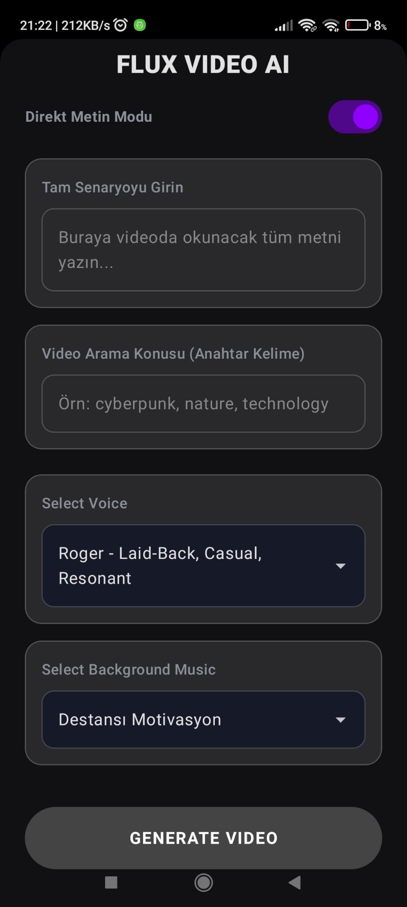
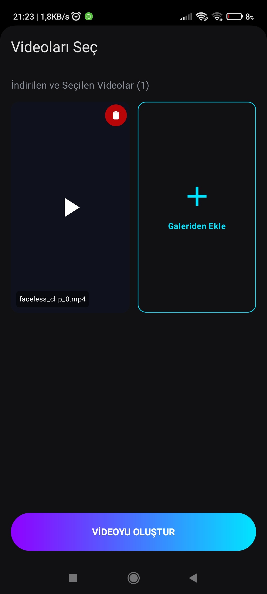
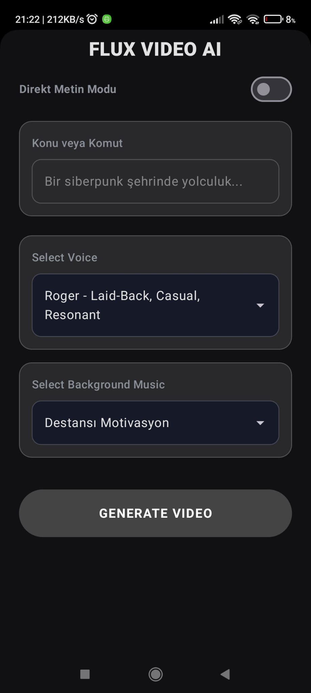

# FacelessVideo AI - Otomatik Kısa Video Üretim Robotu 🤖🎬

FacelessVideo AI, **Jetpack Compose** ile geliştirilmiş, kısa formdaki videoların (YouTube Shorts, Instagram Reels, TikTok) üretimini tamamen otomatize eden güçlü bir Android uygulamasıdır. Yapay zeka modellerini kullanarak senaryo oluşturur, bu senaryoyu sese dönüştürür, ilgili stok videoları bulur ve her şeyi profesyonel bir videoda birleştirir; hem de tek bir tıklamayla!


## 🌟 Öne Çıkan Özellikler

- **🧠 Yapay Zeka Destekli Senaryo:** **Google Gemini API** kullanarak herhangi bir konu hakkında etkileyici 3 cümlelik senaryolar oluşturur.
- **🎙️ Gerçekçi Seslendirme:** **ElevenLabs API** aracılığıyla, kelime düzeyinde altyazı senkronizasyonu sağlayan yüksek kaliteli Metin-Okuma (TTS) dönüşümü.
- **📹 Otomatik Stok Video:** Akıllı anahtar kelime çıkarma ve **Pexels API** üzerinden otomatik ilgili video bulma.
- **🎬 Profesyonel Montaj:** **FFmpeg** kullanarak arka plan müziği miksleme, dinamik altyazı ekleme ve video-ses birleştirme.
- **🎨 Modern UI/UX:** Tamamen Jetpack Compose ile oluşturulmuş, göz alıcı bir **Glassmorphism** tasarım sistemi.
- **🛠️ Manuel Kontrol:** Final çıktısından önce videoları önizleme, istenmeyen klipleri çıkarma veya galeriden kendi videolarınızı ekleme imkanı.

## 🛠 Kullanılan Teknolojiler ve Mimari

Bu proje, ölçeklenebilirlik, sürdürülebilirlik ve test edilebilirliği sağlamak için **Clean Architecture** prensiplerine (Domain, Data, UI katmanları) uygun olarak geliştirilmiştir.

- **Dil:** Kotlin
- **UI Framework:** Jetpack Compose
- **Eşzamanlılık:** Kotlin Coroutines & Flow
- **Bağımlılık Enjeksiyonu (DI):** Dagger Hilt
- **Ağ İletişimi:** Ktor Client
- **Veri İşleme:** Kotlinx Serialization
- **Medya Motoru:** FFmpeg Kit & Media3 (ExoPlayer)
- **Test:** İş mantığı için JUnit 4 Unit Testleri

## 📂 Proje Yapısı

```text
com.serveterdogan.facelessvideo
├── core           # Tasarım sistemi, DI modülleri ve ortak araçlar
├── data           # API ve Repository uygulamaları (Implementation)
├── domain         # İş mantığı: Modeller ve Repository Arayüzleri (Interface)
└── presentation   # UI: ViewModel'ler, Composable ekranlar ve Navigasyon
```

## 🚀 Başlangıç

### Gereksinimler

Projeyi çalıştırmak için aşağıdaki servislerden API anahtarlarına ihtiyacınız vardır:
1. [Google AI (Gemini)](https://aistudio.google.com/)
2. [ElevenLabs](https://elevenlabs.io/)
3. [Pexels](https://www.pexels.com/api/)

### Kurulum Talimatları

1. **Projeyi klonlayın:**
   ```bash
   git clone https://github.com/ServetErdogan09/facelessvideo.git
   ```

2. **API Anahtarlarınızı Ekleyin:**
   Kök dizindeki `local.properties` dosyasını açın ve aşağıdaki satırları ekleyin:
   ```properties
   GEMINI_API_KEY=api_anahtariniz_buraya
   ELEVENLABS_API_KEY=api_anahtariniz_buraya
   PEXELS_API_KEY=api_anahtariniz_buraya
   ```

3. **Derleyin ve Çalıştırın:**
   Projeyi Gradle ile senkronize edin ve bir Android cihazda (API 24+) çalıştırın.

## 🧪 Testler

Proje, kritik iş mantığı için Birim Testleri (Unit Tests) içerir. Bunları Android Studio üzerinden veya komut satırından çalıştırabilirsiniz:
```bash
./gradlew testDebugUnitTest
```

## 📸 Ekran Görüntüleri

| Giriş Ekranı | Video Seçimi | Final Sonuç |
| :---: | :---: | :---: |
|  |  |  |

---
Geliştiren: [Servet Erdoğan](https://github.com/ServetErdogan09)
